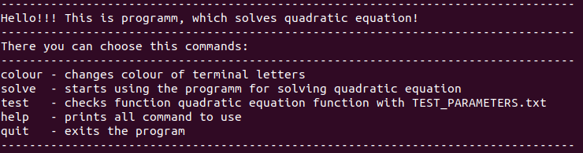
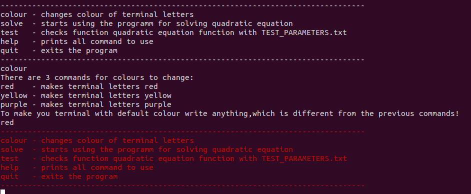
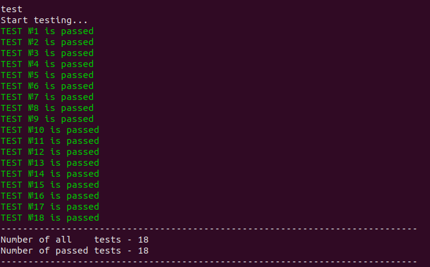
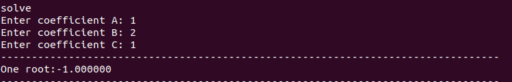

# __MY QUADRATIC EQUATION SOLVER PROGRAMM__
---
[How does it work?](#overview)

[How to install and run this programm?](#installation)

[How to use this programm?](#usage)

[Credits](#credits)

## How does it work?

The option of this programm is to solve quadratic equations (Ax^2 + Bx + C =0) and print the roots in the terminal.
Coefficients can be entered from keyboard.
Also it has other options for testing and if you have LINUX - changing colours in terminal. All commands you can see in the usage of this programm.

## How to install and run this programm?

### Installation

> $ git clone https://github.com/NvOiVkItKoOrV/Quadratic.git

### Compilation
> $ make

### Running
> $ make run

## How to use this programm?
There are 5 commands of using my programm, which you can see there with their descriptions:

If you want to change the colour of your terminal in this programm, you can use __colour__ command, which can show you list of colours you can to set:

If you forgot the commands you can use, you can write the command __help__

If you doubt the correctness of the program, you can test it with command __test__ ,which enters the values ​​from the file __TEST_PARAMETERS.txt__ , where 6 parameters are written in the line: 3 - coefficients A, B, C, 2 roots and the number of roots:

And now we can see the main command for this programm - __solve__

You need to enter 3 coefficients in turn from the keyboard, each time pressing __Enter__ . Immediately after entering all the coefficients, you can see all solutions of this equation:

## Credits
___Created by Viktor Novikov :)___

